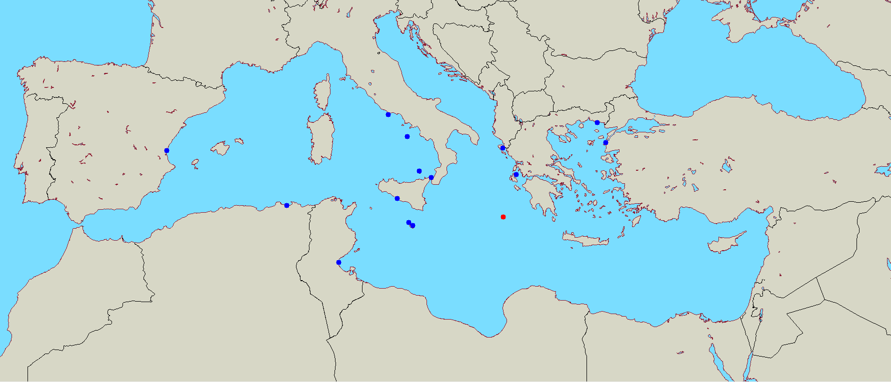
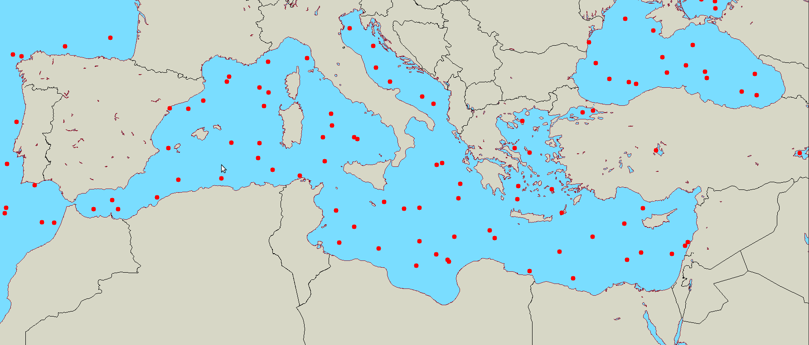

# Ships on the Mediterranean
Simulates ships on a map of the Mediterranean sea. This project has three parts:
* Odysseus' Journey in the Mediterranean
* Ship Spawner
* Ship Controller

(This project is from May 2020.)

## Odysseus' Journey in the Mediterranean
Relevant file: `odyssey.py`.  Simulates Odysseus' journey in the Mediterranean from when he leaves Ithaca for Troy until the end of his long journey after the war. Essentially covers both the Iliad and Odyssey. Itinerary:
1. Ithaca
2. Troy
3. Ismaros
4. Tunis
5. Cyclops
6. Aeolia
7. South of Sicily
8. Vicinity of Ithaca
9. South of Sicily
10. Aeolia
11. Telepylos
12. Circe
13. Underworld
14. Circe
15. Sirens
16. Sylla
17. Helios
18. Scylla
19. Ogygia
20. Scherzia
21. Ithaca

🔴: Odysseus  
🔵: Location in the itinerary

## Ship Spawner
Relevant file: `ship_spawner.py`. The user spawns ships with the mouse. The ships wiggle (i.e. Brownian motion) indefinitely afterwards.

## Ship Controller
Relevant file: `ship_controller.py`. The arrow keys control a single ship. The key bindings in the current code were determined on a Windows computer. It does not work on Linux, and probably not work on other systems either.

## Sources
* `dijkstra.py` and `grid.py` were taken from a GitHub repository of [Lim Ming Yean](https://github.com/mlyean) called [`grid-pathfinding`](https://github.com/mlyean/grid-pathfinding). `dijkstra.py` was later slightly modified.

* The Mediterranean map was taken from [alternatehistory.com](https://www.alternatehistory.com/wiki/doku.php?id=blank_map_directory:all_of_europe_2).